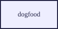

= Tebako dogfood document
:mn-document-class: iso
:mn-output-extensions: xml,html,doc,pdf
:doctype: international-standard
:docstage: 60
:docsubstage: 60
:copyright-year: 2026
:revdate: 2026-07-27
:language: en
:script: Latn
:technical-committee: TC 999
:docnumber: 9999
:title: Tebako dogfood document
:imagesdir: .
:local-cache-only:

== Scope

This document exists to prove the tebako-packages metanorma payload: a real
compile whose figure is rasterized through the inkscape toolkit payload
(SVG -> PNG/EMF via vectory), mounted at /opt/inkscape by the dispatcher.

.A figure that exercises the inkscape SVG path

